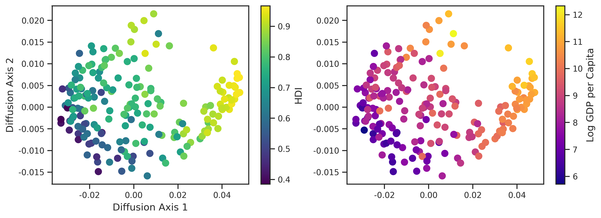

# The Nonlinear Geometry of State-Building: Mapping Global Governance Trajectories via Manifold Learning

[](https://www.python.org/downloads/)
[](https://opensource.org/licenses/MIT)

## Overview

This project moves beyond discrete regime typologies by modeling state architecture as a continuous, low-dimensional **Diffusion Manifold**. Using cross-national longitudinal data, we map the "shape" of governance through time, identifying topological voids in developmental space and classifying state trajectories based on their geometric efficiency.

## Visualizing the Manifold


*Figure 1: The continuous diffusion manifold colored by HDI and Log GDP, revealing the primary gradients of institutional development.*

### Key Methodology & Findings
* **Diffusion Maps:** Capturing non-linear relationships in institutional data (VDEM & WDI) to define a "Reference Manifold."
* **Topological Data Analysis (TDA):** Using Vietoris-Rips complexes to identify "Developmental Voids"—regions of the institutional state-space that are historically or structurally inaccessible.
* **Trajectory Typologies:** Classifying country movements (1900–2026) into **Direct**, **Meandering**, and **Erratic** paths based on tortuosity and geodesic efficiency.
* **Systemic Dispersion:** Measuring how the global "swarm" of nations expands or contracts across the manifold over the last century.

## Repository Structure

```text
diffusion-manifold/
├── data/               # QoG Standard Time-Series & Cross-Sectional datasets
├── figures/            # Generated PNG and PDF (vector) manifolds/TDA plots
├── paper/              # LaTeX source code for the manuscript
├── src/                # Jupyter notebooks for Manifold Learning & TDA
├── .gitignore          # Configured for Python, LaTeX, and large CSVs
├── requirements.txt    # Dependencies (gudhi, sklearn, seaborn, etc.)
└── README.md           # Project documentation
```

## Data Requirements

This analysis utilizes the **Quality of Government (QoG) Standard Dataset** (Jan 2026 release). Due to size and licensing, it is not included in this repository.

1. Download the `qog_std_cs_jan26.csv` and `qog_std_ts_jan26.csv` files from the [official QoG Institute website](https://www.gu.se/en/quality-government/qog-data/data-downloads/standard-dataset).
2. Place both `.csv` files directly into the `data/` directory.

## Installation & Usage

1. **Clone the repository:**
   ```bash
   git clone https://github.com/adibatic/governance-topology.git
   cd governance-topology
   ```

2. **Set up a virtual environment (recommended):**
   ```bash
   python -m venv venv
   source venv/bin/activate  # On Windows use `venv\Scripts\activate`
   ```

3. **Install the required packages:**
   ```bash
   pip install -r requirements.txt
   ```

4. **Run the analysis:**
   Open `src/analysis.ipynb` using your preferred notebook environment (e.g., VS Code, Cursor, or JupyterLab). Running the cells sequentially will:
   * Perform KNN imputation for missing values.
   * Generate the Diffusion Manifold using the RBF kernel.
   * Conduct Topological Data Analysis (TDA) via the GUDHI library.
   * Export all figures to the figures/ directory.

## Writing & Manuscript

The manuscript is located in the `paper/` directory. 
* To compile the PDF locally, ensure you have a LaTeX distribution (such as TeX Live or MiKTeX) installed.
* Open `paper/main.tex` in your editor and compile using `latexmk` or the LaTeX Workshop extension.
* Note: The manuscript is configured to pull vector figures (PDF) directly from the `figures/` directory.

## Author

**Adriel I. Santoso** Department of Mechanical and Aerospace Engineering, Tohoku University
